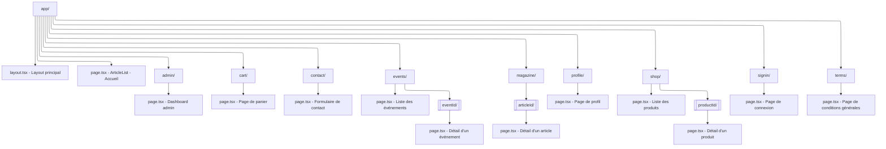

# inHerbisVeritas

E-commerce et magazine sur les plantes médicinales développé avec Next.js 13, React 18.2.0, Tailwind CSS, et les composants UI de ShadCN.

## Architecture

Ce projet utilise une architecture à trois couches :

1. **Frontend Next.js (inHerbisVeritas)** - Ce dépôt
   - Interface utilisateur et présentation
   - Next.js 13.5.6, React 18.2.0, et Tailwind CSS
   - Composants ShadCN pour une UI élégante et responsive
   - Interagit avec le serveur d'authentification via des appels API

2. **Serveur d'authentification (IhvAuth)** - Projet séparé
   - Gère toutes les opérations critiques de sécurité et d'authentification
   - Exposé à l'URL http://localhost:5000 en développement

3. **Backend Supabase**
   - Fournit la base de données et les services associés

## Installation

```bash
# Installer les dépendances
npm install

# Lancer le serveur de développement
npm run dev
```

## Environnement

Assurez-vous de configurer les variables d'environnement dans le fichier `.env.local` :

```
# Authentification
API_URL=http://localhost:5000

# Supabase
NEXT_PUBLIC_SUPABASE_URL=votre_url_supabase
NEXT_PUBLIC_SUPABASE_ANON_KEY=votre_clé_anon_supabase

# Stripe
NEXT_PUBLIC_STRIPE_PUBLISHABLE_KEY=votre_clé_stripe_publishable
```

## Structure du projet

```
inherbisveritas/
├── app/                      # Dossier principal (App Router de Next.js)
│   ├── page.tsx              # Page d'accueil (Boutique)
│   ├── magazine/             # Section Magazine
│   │   ├── page.tsx          # Liste des articles
│   │   └── [articleId]/      # Pages détaillées des articles
│   ├── shop/                 # Version alternative de la boutique (/shop)
│   ├── profile/              # Profil utilisateur
│   ├── events/               # Événements et ateliers
│   └── contact/              # Page de contact
├── src/
│   ├── components/           # Composants réutilisables
│   │   ├── ui/               # Composants UI de base (ShadCN)
│   │   └── shop/             # Composants spécifiques à la boutique
│   ├── contexts/             # Contextes React
│   ├── hooks/                # Hooks personnalisés
│   └── services/             # Services (API, authentification, etc.)
├── public/                   # Fichiers statiques
└── .env.local                # Variables d'environnement locales
```

## Palette de couleurs

inHerbisVeritas utilise une palette de couleurs méditerranéenne distinctive qui renforce l'identité visuelle du site :

```
Palette principale :
├── Blanc calcaire (#F2F2EF)  # Fond principal, surfaces
├── Bleu Méditerranée (#4A90E2)  # Boutons, éléments interactifs
├── Vert olive (#808F4D)  # Logo, navigation active, validations
├── Ocre provençal (#D98E04)  # Bordures, sous-titres, textes secondaires
└── Lavande douce (#A58FAA)  # Éléments décoratifs, effets de survol
```

### Typographie

Le site utilise deux polices complémentaires :
- **Cinzel** : Police serif élégante utilisée pour les titres et éléments d'importance
- **Raleway** : Police sans-serif moderne et lisible pour le corps du texte

Ces polices sont importées via Next.js (`next/font/google`) dans `layout.tsx` et configurées globalement dans `globals.css`.

### Utilisation

Les couleurs sont disponibles via :

1. **Variables CSS** définies dans `globals.css`
   ```css
   --calcaire: 60 11% 94%;       /* #F2F2EF */
   --mediterranee: 213 73% 59%;  /* #4A90E2 */
   --olive: 73 30% 43%;          /* #808F4D */
   --ocre: 39 96% 43%;           /* #D98E04 */
   --lavande: 281 17% 62%;       /* #A58FAA */
   ```

2. **Classes Tailwind** configurées dans `tailwind.config.js`
   ```jsx
   // Exemples d'utilisation
   <div className="bg-calcaire">Fond principal</div>
   <button className="bg-mediterranee text-white">Bouton principal</button>
   <span className="text-olive">Texte validé</span>
   <h2 className="text-ocre">Sous-titre</h2>
   <div className="hover:text-lavande">Élément avec effet de survol</div>
   ```

3. **Classes d'utilitaires** pour les composants communs
   ```css
   .btn-primary { /* Utilise la couleur bleu Méditerranée */ }
   .nav-link-active { /* Utilise la couleur vert olive */ }
   ```

## Pages et fonctionnalités

- **Page d'accueil** : Boutique avec produits et filtres
- **Magazine** : Articles sur les plantes médicinales et leurs bienfaits
- **Profil utilisateur** : Gestion du compte, historique des commandes
- **Contact** : Formulaire de contact et informations

## Développement

```bash
# Démarrer en mode développement
npm run dev

# Compiler l'application
npm run build

# Démarrer en mode production
npm start

# Lancer les tests
npm test
```

## Structure des routes

Vous pouvez visualiser la structure des routes de l'application à partir du diagramme ci-dessous:



Visualisez ce diagramme dans Mermaid Live Editor: https://mermaid.live/
