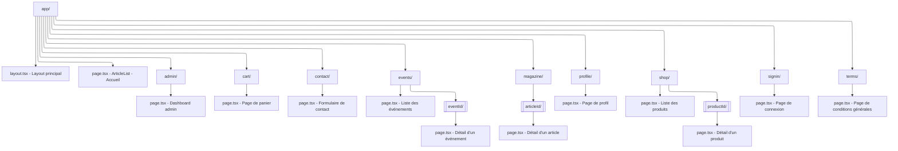

# inHerbisVeritas

E-commerce et magazine sur les plantes médicinales développé avec Next.js 13, React 18.2.0, Tailwind CSS, et les composants UI de ShadCN.

## Architecture

Ce projet utilise une architecture à trois couches :

1. **Frontend Next.js (inHerbisVeritas)** - Ce dépôt
   - Interface utilisateur et présentation
   - Next.js 13.5.6, React 18.2.0, et Tailwind CSS
   - Composants ShadCN pour une UI élégante et responsive
   - Interagit avec le serveur d'authentification via des appels API

2. **Serveur d'authentification (IhvAuth)** - Projet séparé
   - Gère toutes les opérations critiques de sécurité et d'authentification
   - Exposé à l'URL http://localhost:5000 en développement

3. **Backend Supabase**
   - Fournit la base de données et les services associés

## Installation

```bash
# Installer les dépendances
npm install

# Lancer le serveur de développement
npm run dev
```

## Environnement

Assurez-vous de configurer les variables d'environnement dans le fichier `.env.local` :

```
# Authentification
API_URL=http://localhost:5000

# Supabase
NEXT_PUBLIC_SUPABASE_URL=votre_url_supabase
NEXT_PUBLIC_SUPABASE_ANON_KEY=votre_clé_anon_supabase

# Stripe
NEXT_PUBLIC_STRIPE_PUBLISHABLE_KEY=votre_clé_stripe_publishable
```

## Structure du projet

```
inherbisveritas/
├── app/                      # Dossier principal (App Router de Next.js)
│   ├── page.tsx              # Page d'accueil (Boutique)
│   ├── magazine/             # Section Magazine
│   │   ├── page.tsx          # Liste des articles
│   │   └── [articleId]/      # Pages détaillées des articles
│   ├── shop/                 # Version alternative de la boutique (/shop)
│   ├── profile/              # Profil utilisateur
│   ├── events/               # Événements et ateliers
│   └── contact/              # Page de contact
├── src/
│   ├── components/           # Composants réutilisables
│   │   ├── ui/               # Composants UI de base (ShadCN)
│   │   ├── shop/             # Composants spécifiques à la boutique
│   │   ├── icons/            # Composants d'icônes SVG isolés
│   │   └── layout/           # Composants de mise en page (NavBar, Footer)
│   ├── styles/               # Système de design
│   │   ├── tokens/           # Tokens de design (couleurs, typographie, espacement)
│   │   └── theme/            # Configuration des thèmes et composants
│   ├── contexts/             # Contextes React
│   ├── hooks/                # Hooks personnalisés
│   └── services/             # Services (API, authentification, etc.)
├── public/                   # Fichiers statiques
└── .env.local                # Variables d'environnement locales
```

## Design System

inHerbisVeritas implémente un design system cohérent avec une architecture modulaire basée sur des tokens de design. Cette approche garantit une expérience utilisateur consistante et facilite la maintenance.

### Architecture du Design System

```
/src/styles
├── /tokens              # Tokens de design atomiques
│   ├── colors.ts        # Tokens de couleurs
│   ├── typography.ts    # Tokens de typographie
│   ├── spacing.ts       # Tokens d'espacement
│   └── index.ts         # Export centralisé
├── /theme
│   ├── components.ts    # Styles spécifiques aux composants
│   └── index.ts         # Export centralisé
└── index.ts             # Point d'entrée principal
```

### Tokens de design sémantiques

Les tokens de design sont nommés selon leur fonction (approche sémantique) plutôt que leur apparence :

```typescript
// Exemple simplifié des tokens de couleurs
export const colors = {
  // Couleurs primitives
  palette: {
    lightNeutral: '#F2F2EF',  // Ancien "calcaire"
    primary500: '#4A90E2',    // Ancien "mediterranee"
    accent500: '#808F4D',     // Ancien "olive"
    // etc.
  },
  
  // Couleurs sémantiques
  semantic: {
    background: 'var(--color-background)',
    primary: {
      base: 'var(--color-primary)',
      hover: 'var(--color-primary-hover)',
    },
    accent: 'var(--color-accent)',
    // etc.
  }
};
```

## Palette de couleurs

inHerbisVeritas utilise une palette de couleurs méditerranéenne distinctive avec une nomenclature sémantique :

```
Couleurs primitives :
├── Neutral100 (#F2F2EF)   # Ancien "calcaire"
├── Primary500 (#4A90E2)   # Ancien "mediterranee"
├── Accent500 (#808F4D)    # Ancien "olive"
├── Neutral500 (#D98E04)   # Ancien "ocre"
└── Secondary500 (#A58FAA) # Ancien "lavande"

Couleurs sémantiques :
├── Background      # Fond principal
├── Primary         # Couleur principale pour boutons, liens
├── Accent          # Accents, éléments importants
├── Secondary       # Éléments secondaires
└── Border          # Bordures et séparateurs
```

Les variables CSS correspondantes sont définies dans `globals.css` et accessibles via Tailwind CSS.

### Typographie

Le site utilise deux polices complémentaires :
- **Cinzel** : Police serif élégante utilisée pour les titres et éléments d'importance
- **Raleway** : Police sans-serif moderne et lisible pour le corps du texte

Ces polices sont importées via Next.js (`next/font/google`) dans `layout.tsx` et configurées globalement dans les tokens de typographie.

### Développement de composants

Les composants suivent le pattern de "compound components" lorsqu'ils sont complexes, et sont séparés en composants serveur et client grâce à des wrappers. Les composants d'icônes sont isolés pour optimiser les performances.

### Utilisation du Design System

Les tokens de design sont disponibles via :

1. **Variables CSS** définies dans `globals.css`
2. **Classes Tailwind** configurées dans `tailwind.config.js`
3. **API TypeScript** via l'import des tokens depuis `src/styles`

Exemple d'utilisation des tokens dans un composant :
```tsx
import { colors, typography } from '@/styles';

// Utilisation directe dans le code
const primaryColor = colors.semantic.primary.base;

// Utilisation avec les classes Tailwind
<button className={`${colors.tailwind.primary.base} ${typography.tailwind.heading}`}>
  Bouton principal
</button>
```

## Composants et architecture

### Pattern de composants composables

inHerbisVeritas utilise un pattern de composants composables pour garantir la modularité, la réutilisabilité et la séparation des préoccupations. Ce pattern est particulièrement visible dans l'implémentation des cartes produits.

#### Cartes produits refactorisées

Les cartes produits suivent une architecture modulaire avec un système de composition :

```
/src/components/shared/ProductCard/
├── ProductCard.tsx                # Composant de base (serveur)
├── ProductCardActions.tsx         # Actions (client)
├── ProductCardCategory.tsx        # Catégorie du produit
├── ProductCardContext.tsx         # Contexte partagé
├── ProductCardDescription.tsx     # Description du produit
├── ProductCardImage.tsx           # Image avec badges
├── ProductCardPrice.tsx           # Prix avec gestion des remises (client)
├── ProductCardTitle.tsx           # Titre du produit
├── ComposedProductCard.tsx        # Version composée (client)
└── index.ts                       # Exports
```

Cette structure présente plusieurs avantages :

1. **Évite les dépendances circulaires** grâce à des imports unidirectionnels
2. **Sépare les composants client et serveur** selon les exigences de Next.js
3. **Facilite la personnalisation** en permettant l'utilisation des sous-composants individuellement
4. **Maintient la cohérence** via un contexte partagé qui évite le prop drilling

#### Utilisation des cartes produits

Version composée (recommandée pour la plupart des cas) :

```tsx
<ComposedProductCard 
  product={product}
  onAddToCart={handleAddToCart}
  variant="default" // ou "horizontal"
/>
```

Version modulaire (pour des personnalisations avancées) :

```tsx
<ProductCard product={product} addToCart={handleAddToCart}>
  <ProductCardImage />
  <div className="p-4">
    <ProductCardCategory />
    <ProductCardTitle />
    <ProductCardDescription maxLines={2} />
    <div className="mt-4 flex justify-between items-center">
      <ProductCardPrice />
      <ProductCardActions />
    </div>
  </div>
</ProductCard>
```

Cette flexibilité permet de répondre à différents besoins d'affichage tout en maintenant une apparence cohérente.

## Composants

### Layout
- `Navbar` et sous-composants de navigation
- `Footer` et sous-composants de pied de page

### Shop
- `ProductCard` et sous-composants pour l'affichage des produits
- `ShopFilters` pour le filtrage des produits

### Magazine
- `ArticleCard` pour l'affichage des articles
- `ArticleContent` pour le contenu des articles

### Contact
- `ContactHeader` - En-tête immersif pour la page contact
- `ContactCards` - Cartes d'informations de contact (téléphone, email, adresse)
- `ContactSocial` - Section de liens vers les réseaux sociaux
- `ContactFAQ` - Accordéon pour les questions fréquentes
- `ContactCTA` - Call-to-action pour rediriger vers la boutique ou les articles

### UI
Composants d'interface utilisateur réutilisables :

- `Button` - Boutons personnalisables
- `Card` - Conteneurs de type carte
- `Accordion` - Panneaux déroulants pour les FAQ et autres contenus
- Et plus encore...

## Tests

Le projet utilise Jest et React Testing Library pour les tests unitaires des composants.

### Exécution des tests

```bash
# Exécuter tous les tests
npm test

# Exécuter des tests spécifiques
npm test -- tests/footer.test.tsx

# Exécuter les tests avec un mode watch
npm test -- --watch
```

### Structure des tests

Les tests sont organisés dans le dossier `/tests` avec la convention de nommage `[component-name].test.tsx`.

- **Composants atomiques** : Tests pour chaque composant individuel
- **Composants composés** : Tests pour les composants assemblés comme `ComposedNavbar` et `ComposedFooter`

### Méthodologie de test

Les tests suivent une approche de *black box testing* qui se concentre sur le comportement observable des composants plutôt que sur leur implémentation interne. Cela inclut :

1. **Rendu des éléments** : Vérification que les composants s'affichent correctement
2. **Comportement interactif** : Tests des interactions utilisateur (clics, saisies)
3. **Navigation** : Vérification des liens et routes
4. **État des composants** : Tests de changement d'état (ex: formulaires)

### Mocks

Les tests utilisent des mocks pour isoler les composants de leurs dépendances :

- **Hooks personnalisés** : Les hooks comme `useNavbar` et `useFooter` sont mockés
- **Composants UI** : Les composants UI complexes sont simplifiés
- **Icônes** : Les icônes sont remplacées par des div avec des data-testid
- **Next.js** : Les fonctionnalités spécifiques à Next.js sont mockées

## Composants de mise en page

### Navbar

Le composant Navbar a été implémenté avec une architecture modulaire :

- **Navbar.tsx** : Composant de base utilisant Bar
- **NavbarBrand.tsx** : Logo et identité de la marque
- **NavbarLinks.tsx** : Liens de navigation principaux
- **NavbarActions.tsx** : Actions comme panier et compte utilisateur
- **NavbarMobileMenu.tsx** : Menu adaptatif pour mobile
- **ComposedNavbar.tsx** : Assemblage des composants
- **useNavbar.tsx** : Hook personnalisé pour la logique

### Footer

Le Footer suit la même architecture modulaire que la Navbar :

- **Footer.tsx** : Composant de base utilisant Bar
- **FooterBrand.tsx** : Logo et description de l'entreprise
- **FooterLinks.tsx** : Liens de navigation organisés par catégories
- **FooterLegal.tsx** : Informations légales et copyright
- **FooterNewsletter.tsx** : Formulaire d'inscription à la newsletter
- **FooterSocial.tsx** : Liens vers les réseaux sociaux
- **ComposedFooter.tsx** : Assemblage des composants
- **useFooter.tsx** : Hook personnalisé pour les données

Cette architecture facilite la maintenance, les tests unitaires et permet une réutilisation des composants dans différents contextes.

## Pages et fonctionnalités

- **Page d'accueil** : Boutique avec produits et filtres
- **Magazine** : Articles sur les plantes médicinales et leurs bienfaits
- **Profil utilisateur** : Gestion du compte, historique des commandes
- **Contact** : Formulaire de contact et informations

## Développement

```bash
# Démarrer en mode développement
npm run dev

# Compiler l'application
npm run build

# Démarrer en mode production
npm start

# Lancer les tests
npm test
```

## Structure des routes

Vous pouvez visualiser la structure des routes de l'application à partir du diagramme ci-dessous:



Visualisez ce diagramme dans Mermaid Live Editor: https://mermaid.live/
