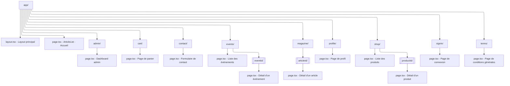

# inHerbisVeritas

E-commerce et magazine sur les plantes médicinales développé avec Next.js 13, React 18.2.0, Tailwind CSS, et les composants UI de ShadCN.

## Architecture

Ce projet utilise une architecture à trois couches :

1. **Frontend Next.js (inHerbisVeritas)** - Ce dépôt
   - Interface utilisateur et présentation
   - Next.js 13.5.6, React 18.2.0, et Tailwind CSS
   - Composants ShadCN pour une UI élégante et responsive
   - Interagit avec le serveur d'authentification via des appels API

2. **Serveur d'authentification (IhvAuth)** - Projet séparé
   - Gère toutes les opérations critiques de sécurité et d'authentification
   - Exposé à l'URL http://localhost:5000 en développement

3. **Backend Supabase**
   - Fournit la base de données et les services associés

## Installation

```bash
# Installer les dépendances
npm install

# Lancer le serveur de développement
npm run dev
```

## Environnement

Assurez-vous de configurer les variables d'environnement dans le fichier `.env.local` :

```
# Authentification
API_URL=http://localhost:5000

# Supabase
NEXT_PUBLIC_SUPABASE_URL=votre_url_supabase
NEXT_PUBLIC_SUPABASE_ANON_KEY=votre_clé_anon_supabase

# Stripe
NEXT_PUBLIC_STRIPE_PUBLISHABLE_KEY=votre_clé_stripe_publishable
```

## Structure du projet

```
inherbisveritas/
├── app/                      # Dossier principal (App Router de Next.js)
│   ├── page.tsx              # Page d'accueil (Boutique)
│   ├── magazine/             # Section Magazine
│   │   ├── page.tsx          # Liste des articles
│   │   └── [articleId]/      # Pages détaillées des articles
│   ├── shop/                 # Version alternative de la boutique (/shop)
│   ├── profile/              # Profil utilisateur
│   ├── events/               # Événements et ateliers
│   └── contact/              # Page de contact
├── src/
│   ├── components/           # Composants réutilisables
│   │   ├── ui/               # Composants UI de base (ShadCN)
│   │   └── shop/             # Composants spécifiques à la boutique
│   ├── contexts/             # Contextes React
│   ├── hooks/                # Hooks personnalisés
│   └── services/             # Services (API, authentification, etc.)
├── public/                   # Fichiers statiques
└── .env.local                # Variables d'environnement locales
```

## Pages et fonctionnalités

- **Page d'accueil** : Boutique avec produits et filtres
- **Magazine** : Articles sur les plantes médicinales et leurs bienfaits
- **Profil utilisateur** : Gestion du compte, historique des commandes
- **Contact** : Formulaire de contact et informations

## Développement

```bash
# Démarrer en mode développement
npm run dev

# Compiler l'application
npm run build

# Démarrer en mode production
npm start

# Lancer les tests
npm test
```

## Structure des routes

Vous pouvez visualiser la structure des routes de l'application à partir du diagramme ci-dessous:



[Visualiser ce diagramme dans Mermaid Live Editor](https://mermaid.live/edit#pako:eNqtlE1vgzAMhv-KlROV2M4HlbZLs1PVXXbYuS0HD7ipJCgoqaYh_vvMOqAdh6nqBY4TJ_Zrx3H3TAuSQRrzkgxFYa_HrGAxl1w-CCbcljKPJ3pDSNE2KCFmQ_zOGT8YK9BDk5eVVRyAMvnbYVRs4aRyJ5iy0shQPk3ZPM1VjJDIRQqWFIzdyoKL1wPZnXIRH3pJDg7U37G5HYDHFqpBJ0sQmvMJQ7K9fV3fPez9kfP_pSNzI15qJa_8o-qfVNSy_F3mJRkbwGSo4RIW6w0skTlKYzCQ5jvP2-5i6tCFi2yxQtDOBrGDLdMKtsrPbIVxmZCmdrWAFWk6ByhIgvbaSEPaZE09R8a8nDQVPJtkDfO08KkrtFHqEX7aLVIoXI3RdH4tRu8jKh_HqXXMjdVgHQRtq2aYHwYzPLe7nqk7pM2gblB2_aqRjZjcC0XZF4x5Uu0)
